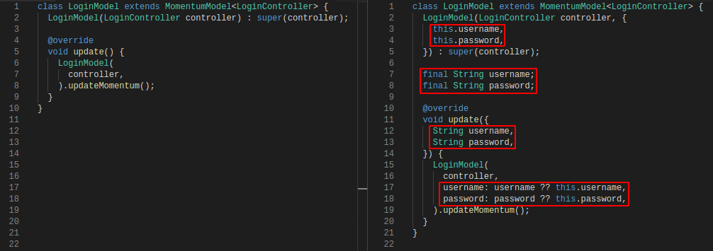

# Boilerplate Code
In general, you only have to make 2 classes called components. It is highly recommended to separate them into files. We're gonna take *login* component for this document as a sample to go with explaining the boilerplate code.

## Model
It only consist of 10 lines. It extends the abstract base class `MomentumModel` which requires a type parameter for indicating what type of *controller* this model is attached to. The constructor also requires an instance of the specified controller type. You DON'T have to worry about _"where and how do I pass it to this model?"_.
```dart
class LoginModel extends MomentumModel<LoginController> {
  LoginModel(LoginController controller) : super(controller);

  @override
  void update() {
    LoginModel(
      controller,
    ).updateMomentum();
  }
}
```
The method `update()` is required to be implemented. This method should follow how `copyWith(...)` method works. Take a look at this code:
```dart
LoginModel copyWith({String username, String password}) {
  return LoginModel(
    username: username ?? this.username,
    password: password ?? this.password,
  );
}
```
The concept of *copyWith* is instantiating a copy of object with the new properties provided retaining the previous values of unspecified parameters.

These are the list of similarities in both `update()` and `copyWith(...)` method.
- The constructor parameters are optional
- The `update()` and `copyWith(...)` method parameters are optional.
- The class is immutable. You usually don't make `copyWith` method in mutable classes.

#### Add properties to Model
Login usually has `username` and `password` variables to them. So lets take the boilerplate code above and add these properties to it.



As you can see, there are four steps to add a property to the model. Adding the property on the constructor as optional, declaring final class property, adding parameter on `update()` method and implementing the _copyWith_ logic in the `update()` method body. The part that doubles the length of the code here is the `update()` method. That's basically how `copyWith(...)` method occupies your classes.

## Controller
For a logic class this boilerplate is very short comparing to the model. Only consist of 8 lines. It extends the abstract base class `MomentumController` which requires a type parameter for indicating what type of *model* this controller is attached to. Take a closer look on `this, `. We returned an instance of `LoginModel` and it takes an argument of type `LoginController`. Remember the part earlier where the model class requires an instance of controller? This code solves that and only part of the boilerplate so again you DON'T have to worry about _"where and how do I pass it to the model?"_.
```dart
class LoginController extends MomentumController<LoginModel> {
  @override
  LoginModel init() {
    return LoginModel(
      this,
    );
  }
}
```

#### Add functions to Controller
Adding functions or methods to controller doesn't really have any special rules comparing to Model boilerplate. You can do anything here. For example, you can add functions to set `username` and `password` when user types on a text field.
```dart
class LoginController extends MomentumController<LoginModel> {
  @override
  LoginModel init() {
    return LoginModel(
      this,
    );
  }

  void setUsername(String value) {
    model.update(username: value); // value of password gets retained.
  }

  void setPassword(String value) {
    model.update(password: value); // value of username gets retained.
  }
}
```
You can then call `setUsername(...)` and `setPassword(...)` in your text fields' `onChanged` or `onSaved` later.

## Widget
Widget boilerplate code are usually short and `MomentumBuilder` code is short too.
```dart
MomentumBuilder(
  controllers: [],
  builder: (context, snapshot) {
    return YourWidgetsHere();
  },
);
```

#### Attach data to Widget
Displaying you model data on screen is very easy with `MomentumBuilder`.
```dart
MomentumBuilder(
  controllers: [LoginController],
  builder: (context, snapshot) {
    var login = snapshot<LoginModel>();
    return YourWidgetsHere();
  },
);
```